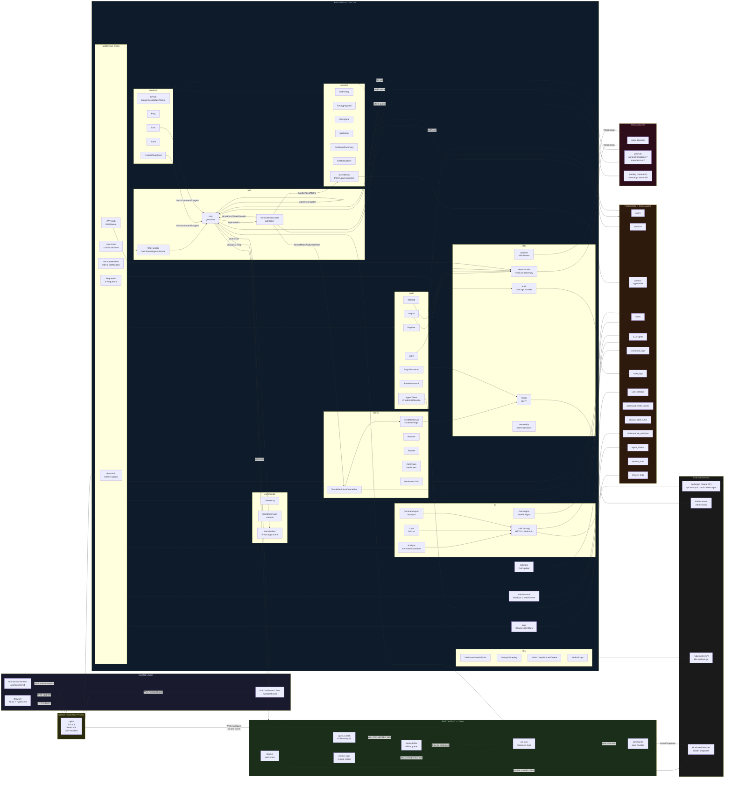

# Mimari Diyagramlar (Mermaid)

Bu dosyadaki diyagramlar [architecture.md](./architecture.md) ile birlikte kullanılır.

```mermaid
graph LR
  subgraph CLIENT["CLIENT LAYER"]
    Browser["Browser\nReact + TypeScript"]
    WS_DB["WS Dashboard Client\n/ws/dashboard"]
    WS_SVC["WS Service Stream\n/ws/services/:id"]
  end

  subgraph NGINX["NGINX REVERSE PROXY"]
    NX["nginx\nTLS 1.3\nRate Limit\nCSP Headers"]
  end

  subgraph BACKEND["BACKEND — Go + Gin"]
    subgraph MIDDLEWARE["Middleware Chain"]
      RL["RateLimit\n100/min global"]
      SRL["StrictLimit\n10/min sensitive"]
      SEC["SecurityHeaders\nHSTS CORS XSS"]
      REQID["RequestID\nX-Request-Id"]
      AUTH["JWT Auth\nMiddleware"]
    end

    subgraph AUTH_MOD["auth/"]
      REG["Register"]
      LOGIN["Login"]
      REFRESH["Refresh"]
      LOGOUT["Logout"]
      FORGOTPW["ForgotPassword"]
      RESETPW["ResetPassword"]
      AGTOKEN["AgentToken\nCreate/List/Revoke"]
    end

    subgraph SVC_MOD["services/"]
      SVCCRUD["CRUD\nCreate/Get/Update/Delete"]
      SVCPING["Ping"]
      SVCEXEC["Exec"]
      SVCSCALE["Scale"]
      SVCCMD["Restart/Stop/Start"]
    end

    subgraph METRICS_MOD["metrics/"]
      MHIST["GetHistory"]
      MAGG["GetAggregated"]
      MUPTIME["GetUptime"]
      MROLLUP["GetRollup"]
      MGLOBAL["GetGlobalSummary"]
      MBULK["GetBulkUptime"]
      MINSERT["InsertMetric\nPOST /api/v1/metrics"]
    end

    subgraph ALERTS_MOD["alerts/"]
      ACHECK["CheckMetricAndCreateAlert"]
      ALIST["GetActive / List"]
      ARESOLVE["Resolve"]
      ASNOOZE["Snooze"]
      ARULE["AlertRules\nGet/Upsert"]
      AEMAIL["sendAlertEmail\ncooldown logic"]
    end

    subgraph AI_MOD["ai/"]
      ANALYZE["Analyze\n/services/:id/analyze"]
      CHAT["Chat\n/ai/chat"]
      REPORT["GenerateReport\n/ai/report"]
      INSIGHTS["GetInsights\nGetAllInsights"]
      CALLCLAUDE["callClaude()\nHTTP to Anthropic"]
    end

    subgraph CMD_MOD["commands/"]
      CMDHISTORY["GetHistory"]
      CMDSEND["SendCommand\nvia Hub"]
      CMDTIMEOUT["MarkStalled\nTimeout goroutine"]
    end

    subgraph WS_MOD["ws/"]
      HUB["Hub\ngoroutine"]
      BROADCASTER["MetricsBroadcaster\npoll ticker"]
      WSHANDLER["WS Handler\nDashboard/Agent/Service"]
    end

    subgraph K8S_MOD["k8s/"]
      K8SSTATUS["GetStatus/Nodes/Pods"]
      K8SDEPLOY["Deploy/Undeploy"]
      K8SHPA["HPA Create/Update/Delete"]
      K8SLOGS["GetPodLogs"]
    end

    subgraph PKG["pkg/"]
      AUDITPKG["audit\nGetLogs Handler"]
      MAILER["mailer\nSMTP"]
      TOKENBL["tokenblacklist\nRedis or InMemory"]
      RATELIMIT["ratelimit\nMiddleware"]
      OWNERSHIP["ownership\nIsServiceOwner"]
    end

    MAINT_MOD["maintenance/\nWindows Create/Delete"]
    SETTINGS_MOD["settings/\nGet/Update"]
    LOGS_MOD["logs/\nServiceLogs/Stats"]
  end

  subgraph AGENT["RUST AGENT — Tokio"]
    AGT_MAIN["main.rs\ntokio::main"]
    AGT_METRICS["metrics task\nsysinfo collect"]
    AGT_WS["ws task\nreconnect loop"]
    AGT_HEALTH["agent_health\nHTTP endpoint"]
    AGT_BUFFER["MetricBuffer\noffline queue"]
    AGT_CMD["commands\nexec handler"]
  end

  subgraph DB["PostgreSQL + TimescaleDB"]
    T_USERS["users"]
    T_SERVICES["services"]
    T_METRICS["metrics\nhypertable"]
    T_ALERTS["alerts"]
    T_INSIGHTS["ai_insights"]
    T_CMDLOGS["command_logs"]
    T_AUDIT["audit_logs"]
    T_SETTINGS["user_settings"]
    T_PWRESET["password_reset_tokens"]
    T_ALERTRULES["service_alert_rules"]
    T_MAINT["maintenance_windows"]
    T_AGENTTOK["agent_tokens"]
    T_SVCMAP["service_map"]
    T_SVCLOGS["service_logs"]
  end

  subgraph REDIS["Redis optional"]
    R_BL["token blacklist"]
    R_PUBSUB["pub/sub\nnanonet:broadcast:*\nnanonet:cmd:*"]
    R_PENDING["pending commands\nnanonet:pc:serviceID"]
  end

  subgraph EXTERNAL["External Services"]
    CLAUDE_API["Anthropic Claude API\napi.anthropic.com/v1/messages"]
    SMTP["SMTP Server\nAlert Emails"]
    K8S_API["Kubernetes API\nk8s.io/client-go"]
    TARGET_SVC["Monitored Services\nhealth endpoints"]
  end

  Browser --"HTTPS REST"--> NX
  Browser --"WSS Upgrade"--> NX
  NX --> MIDDLEWARE
  MIDDLEWARE --> AUTH_MOD
  MIDDLEWARE --> SVC_MOD
  MIDDLEWARE --> METRICS_MOD
  MIDDLEWARE --> ALERTS_MOD
  MIDDLEWARE --> AI_MOD
  MIDDLEWARE --> CMD_MOD
  MIDDLEWARE --> K8S_MOD
  MIDDLEWARE --> AUDITPKG
  MIDDLEWARE --> MAINT_MOD
  MIDDLEWARE --> SETTINGS_MOD
  MIDDLEWARE --> LOGS_MOD
  MIDDLEWARE --> WSHANDLER

  WS_DB --"WSS /ws/dashboard"--> NX
  WS_SVC --"WSS /ws/services/:id"--> NX

  LOGIN --> TOKENBL
  LOGOUT --> TOKENBL
  REFRESH --> TOKENBL
  AUTH --> TOKENBL
  AUTH_MOD --> MAILER

  AGTOKEN --> T_AGENTTOK

  WSHANDLER --> HUB
  HUB --"register/unregister"--> HUB
  HUB --"broadcast msg"--> WS_DB
  HUB --"send cmd"--> AGENT
  HUB --"Redis mode"--> R_PUBSUB
  R_PUBSUB --"fan-out"--> HUB
  HUB --"offline queue"--> R_PENDING

  BROADCASTER --"poll ticker"--> DB
  BROADCASTER --"handleAgentMetric"--> MINSERT
  BROADCASTER --"BroadcastToDashboards"--> HUB
  BROADCASTER --"CheckMetricAndCreateAlert"--> ACHECK

  AGT_MAIN --> AGT_METRICS
  AGT_MAIN --> AGT_WS
  AGT_MAIN --> AGT_HEALTH
  AGT_MAIN --> AGT_BUFFER
  AGT_METRICS --"sysinfo + health check"--> TARGET_SVC
  AGT_METRICS --"WS_CONNECTED true"--> AGT_WS
  AGT_METRICS --"WS_CONNECTED false"--> AGT_BUFFER
  AGT_BUFFER --"drain on reconnect"--> AGT_WS
  AGT_WS --"WSS /ws/agent\nBearer token"--> NX
  AGT_WS --> HUB
  HUB --"type:metrics"--> BROADCASTER
  HUB --"type:result"--> CMDTIMEOUT
  AGT_WS --"type:command"--> AGT_CMD
  AGT_CMD --"restart/stop/exec"--> TARGET_SVC

  ACHECK --> T_ALERTS
  ACHECK --> AEMAIL
  AEMAIL --> MAILER
  MAILER --> SMTP

  ANALYZE --> CALLCLAUDE
  CHAT --> CALLCLAUDE
  REPORT --> CALLCLAUDE
  CALLCLAUDE --> CLAUDE_API
  CALLCLAUDE --> T_INSIGHTS

  SVCCMD --"SendCommandToAgent"--> HUB
  SVCEXEC --"SendCommandToAgent"--> HUB

  K8S_MOD --> K8S_API

  MINSERT --> T_METRICS
  SVC_MOD --> T_SERVICES
  AUTH_MOD --> T_USERS
  ALERTS_MOD --> T_ALERTS
  AUDITPKG --> T_AUDIT
  CMD_MOD --> T_CMDLOGS
  MAINT_MOD --> T_MAINT
  SETTINGS_MOD --> T_SETTINGS
  LOGS_MOD --> T_SVCLOGS
  INSIGHTS --> T_INSIGHTS

  TOKENBL --"Redis mode"--> R_BL
  RATELIMIT --"Redis mode"--> R_BL

  style CLIENT fill:#1a1a2e,color:#e0e0ff
  style BACKEND fill:#0d1b2a,color:#c0d0e0
  style AGENT fill:#1a2e1a,color:#c0e0c0
  style DB fill:#2e1a0d,color:#e0c0a0
  style REDIS fill:#2e0d1a,color:#e0a0c0
  style EXTERNAL fill:#1a1a1a,color:#d0d0d0
  style NGINX fill:#2a2a0d,color:#e0e0a0
```